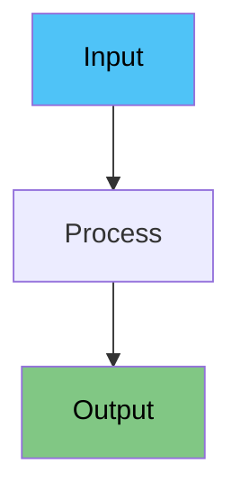

# Comprehensive Deck Content Generation Prompt

This unified prompt will help you create complete, presentation-ready decks with speaker notes, interactive diagrams, and engaging animations.

---

## Part 1: Speaker Notes Generation

Write the speaker notes for a live presentation to freshers/beginners.

### Format & Structure
- Use `###` for slide title at the top of each note
- Use `####` (H4) for section headings within the note
- Minimize blank lines - keep content compact and flowing
- Use **bold** for key terms and *italics* for emphasis
- Use bullet points sparingly - prefer full flowing sentences

### Writing Style
- Write in a **teleprompter-friendly script**: full sentences that flow naturally when spoken aloud
- Use a **conversational, engaging tone** - like you're explaining to a friend
- Keep sentences short to medium length - easy to read while presenting
- Connect ideas smoothly within paragraphs - don't just list disconnected points
- Include smooth **transitions between sections** (e.g., "Now that we've seen X, let's look at Y...")

### Pronunciation Guides
- **Scientific notation**: Always bracket how to read it
  - Example: `2e-5` → "2e-5 (two e minus five)"
  - Example: `1e-3` → "1e-3 (one e minus three)"
  - Example: `5e6` → "5e6 (five e six)"
- **Technical terms/acronyms**: Add pronunciation guide with 👉 for new or difficult terms
  - Example: `RoBERTa` → "RoBERTa 👉 'roh-BER-tuh'"
  - Example: `BERT` → "BERT 👉 'burt'"
  - Example: `spaCy` → "spaCy 👉 'spay-see'"
  - Example: `NVIDIA` → "NVIDIA 👉 'en-VID-ee-uh'"
- **Greek letters**: Include English name
  - Example: `λ` → "λ (lambda)"
  - Example: `α` → "α (alpha)"

### Content Guidelines
- Explain every concept in **very simple words** - assume zero background knowledge
- Add **small examples or analogies** (1-2 lines) wherever helpful to illustrate points
- For technical concepts, explain the "why" not just the "what"
- Include rhetorical questions to engage the audience (e.g., "Simple, right?", "But what about...?")
- End each slide's notes with a natural lead-in to the next topic
- **Always include pronunciation guides** for scientific notation and technical terms on first mention

### Visual Elements in Notes
- Include **Mermaid diagrams** in the notes where helpful to visualize concepts:

- Use emoji sparingly for section headers (e.g., `####  When to Use This?`)
- Use `>` blockquotes for audience interaction prompts:
  >  Ask the audience: "Has anyone experienced this?"

### Pros/Cons Sections
When discussing advantages and disadvantages:
```
####  Pros
The good stuff: [describe benefits in flowing sentences, not just bullets]

####  Cons
The problems: [describe drawbacks in flowing sentences]
```

### Example Note Structure
```
### [Slide Number] [Slide Title]
Opening hook or transition from previous slide. Set context for this topic.

####  [First Section]
Explanation in full sentences. Include an example or analogy here. Make it conversational and easy to follow while presenting.

####  [Key Concept]
\`\`\`mermaid
[diagram if helpful]
\`\`\`
Explain what the diagram shows. Connect it to the main point.

####  When to Use This?
Describe practical scenarios in complete sentences.

####  Pros
The good stuff: [flowing description of benefits]

####  Cons
The problems: [flowing description of drawbacks]

Closing statement that leads into the next slide.
```

### Do NOT Include in Notes
- `[pause]`, `[demo]`, `[point to X]` cue tags - use markdown formatting instead
- Excessive blank lines or `---` horizontal rules
- `##` or `###` headings - use `####` for sections within notes
- Bullet-only content without explanatory sentences
- Jargon without explanation

---

## Part 2: Interactive Mermaid Diagrams

**IMPORTANT**: Whenever you include a Mermaid diagram in the speaker notes, you MUST also add a corresponding `MermaidPopover` component in the slide content JSX.

### How to Add MermaidPopover

1. **Import the component** at the top of the deck file:
```tsx
import { MermaidPopover } from '../components/MermaidPopover';
```

2. **Add the MermaidPopover** inline with the relevant heading in the slide content:
```tsx
<h4>
  How It Works
  <MermaidPopover
    title="Process Flow"
    diagram={`flowchart LR
    A["📋 Input"] --> B["🔍 Process"]
    B --> C["✨ Output"]
    style A fill:#4fc3f7,color:#000
    style C fill:#81c784,color:#000`}
  />
</h4>
```

### MermaidPopover Guidelines

- **Placement**: Add it inside the `<h4>` tag next to headings like "How It Works", "The Flow", "Process Overview", etc.
- **Title**: Use a clear, descriptive title for the diagram
- **Diagram**: Copy the exact Mermaid code from the notes section
- **Styling**: Use consistent color schemes:
  - `#4fc3f7` (blue) for inputs/starts
  - `#81c784` (green) for outputs/success
  - `#ffcdd2` (red) for errors/problems
  - `#ffd700` (gold) for highlights/goals
  - `#e1bee7` (purple) for special items

### Example Pattern

**In Notes:**
```markdown
####  How It Works
The system processes data through three stages...

\`\`\`mermaid
flowchart TB
    A["🤖 Model"] --> B["⚙️ Process"]
    B --> C["✅ Result"]
    style C fill:#81c784,color:#000
\`\`\`
```

**In Slide Content:**
```tsx
<GSAPAnimated animation="slideInLeft" delay={0.3}>
  <div style={{ marginBottom: '0.7em' }}>
    <h4>
      How It Works
      <MermaidPopover
        title="Processing Flow"
        diagram={`flowchart TB
    A["🤖 Model"] --> B["⚙️ Process"]
    B --> C["✅ Result"]
    style C fill:#81c784,color:#000`}
      />
    </h4>
    <ul style={{ fontSize: '0.7em' }}>
      <li>Description of the process...</li>
    </ul>
  </div>
</GSAPAnimated>
```

---

## Part 3: GSAP Animations

Apply creative GSAP animations to bring slides to life visually.

### Import Components
```tsx
import { GSAPAnimated, GSAPStaggerList } from '../components/GSAPAnimated';
```

### Animation Variety
Use a diverse mix of these animations:
- `fadeIn` - Simple fade for subtle entries
- `slideInLeft`, `slideInRight` - Horizontal movements
- `slideInTop`, `slideInBottom` - Vertical movements
- `scaleIn` - Pop-in effects for emphasis
- `bounceIn` - Playful, elastic entries
- `rotateIn` - Spinning entries for wow factor
- `flipCard` - 3D flip effects for dramatic reveals

### Strategic Delays
Vary delay timings to create interesting sequences:
- Quick succession: delays of 0.1-0.2s between elements
- Paced reveals: delays of 0.3-0.5s for emphasis
- Dramatic pauses: delays of 0.6-1.0s for impact

### Creative Patterns for Different Slide Types

**Title Slides**: Use bold, attention-grabbing animations
```tsx
<GSAPAnimated animation="rotateIn" duration={1} delay={0}>
  <SvgIcon iconName="duo-rocket" sizeName="3x" />
</GSAPAnimated>
<GSAPAnimated animation="scaleIn" delay={0.3}>
  <h1>Title</h1>
</GSAPAnimated>
<GSAPAnimated animation="fadeIn" delay={0.6}>
  <p>Subtitle</p>
</GSAPAnimated>
```

**Content Slides**: Mix directional slides for visual flow
```tsx
<GSAPAnimated animation="slideInLeft" delay={0.1}>
  <div>First section</div>
</GSAPAnimated>
<GSAPAnimated animation="slideInRight" delay={0.3}>
  <div>Second section</div>
</GSAPAnimated>
```

**Lists**: Use staggered animations
```tsx
<GSAPStaggerList stagger={0.12} duration={0.7}>
  <div>Item 1</div>
  <div>Item 2</div>
  <div>Item 3</div>
</GSAPStaggerList>
```

**Key Points/Highlights**: Use bounceIn or scaleIn for emphasis
```tsx
<GSAPAnimated animation="bounceIn" duration={1} delay={0.2}>
  <div className="key-point">Important concept!</div>
</GSAPAnimated>
```

**Comparisons (Pros/Cons)**: Use opposing directions
```tsx
<GSAPAnimated animation="slideInLeft" delay={0.1}>
  <div>Pros section</div>
</GSAPAnimated>
<GSAPAnimated animation="slideInRight" delay={0.3}>
  <div>Cons section</div>
</GSAPAnimated>
```

### Animation Guidelines
- **Be Creative & Varied**: Don't use the same animation patterns for every slide
- **Every slide** should have at least one animated element
- **Complex slides** should have 3-5 animated sections with varied timings
- **Icons and visual elements** should use more dramatic animations (rotate, bounce, scale)
- **Text content** can use subtler animations (fade, slide)
- **Lists** always benefit from stagger animations
- **Maintain readability** - don't make animations too fast or too distracting

### Duration Recommendations
- Quick animations (text, small elements): 0.5-0.7s
- Standard animations (content blocks): 0.7-0.9s
- Dramatic animations (titles, highlights): 0.9-1.2s
- Stagger durations: 0.5-0.8s

### Randomization Tips
- Don't use the same animation type twice in a row on consecutive slides
- Vary between quick (0.5-0.7s) and slow (0.9-1.2s) durations
- Mix subtle animations (fadeIn) with dramatic ones (bounceIn, rotateIn)
- Use different stagger values (0.08, 0.12, 0.15, 0.2) for variety

### Animation Type Guide

| Animation | Best For | Impact Level |
|-----------|----------|--------------|
| `fadeIn` | Text, backgrounds | Subtle |
| `slideInLeft/Right` | Content blocks, comparisons | Medium |
| `slideInTop/Bottom` | Headers, footers | Medium |
| `scaleIn` | Numbers, icons, emphasis | High |
| `bounceIn` | CTAs, highlights | High |
| `rotateIn` | Icons, logos | Very High |
| `flipCard` | Reveals, transitions | Very High |

---

## Complete Example Slide

Here's a full example combining all three elements:

```tsx
{
  id: 3,
  title: 'How It Works',
  icon: { name: 'duo-gear' },
  content: (
    <div style={{ textAlign: 'left' }}>
      <GSAPAnimated animation="slideInTop" delay={0.1}>
        <div style={{ marginBottom: '0.7em' }}>
          <h4>Goal</h4>
          <ul style={{ fontSize: '0.7em' }}>
            <li>Achieve high accuracy with less data</li>
          </ul>
        </div>
      </GSAPAnimated>
      
      <GSAPAnimated animation="slideInLeft" delay={0.3}>
        <div style={{ marginBottom: '0.7em' }}>
          <h4>
            How It Works
            <MermaidPopover
              title="Processing Pipeline"
              diagram={`flowchart LR
    A["📄 Input"] --> B["⚙️ Process"]
    B --> C["✅ Output"]
    style A fill:#4fc3f7,color:#000
    style C fill:#81c784,color:#000`}
            />
          </h4>
          <ul style={{ fontSize: '0.7em' }}>
            <li>Process data through multiple stages</li>
          </ul>
        </div>
      </GSAPAnimated>
      
      <GSAPAnimated animation="slideInRight" delay={0.5}>
        <div style={{ marginBottom: '0.7em' }}>
          <h4>When to Use</h4>
          <ul style={{ fontSize: '0.7em' }}>
            <li>Limited training data available</li>
          </ul>
        </div>
      </GSAPAnimated>
    </div>
  ),
  backgroundColor: '#2d4a6f',
  notes: `### How It Works
Let's explore how this process actually functions in practice.

####  The Goal
We want to achieve **high accuracy with minimal training data**. This is crucial when you're working in specialized domains where labeled data is expensive or time-consuming to create.

####  How It Works
The system operates through a multi-stage pipeline that transforms raw input into actionable results.

\`\`\`mermaid
flowchart LR
    A["📄 Input"] --> B["⚙️ Process"]
    B --> C["✅ Output"]
    style A fill:#4fc3f7,color:#000
    style C fill:#81c784,color:#000
\`\`\`

At each stage, the data is refined and enhanced, gradually moving from raw input to polished output.

####  When to Use This?
This approach works best when you have **limited training data** available. It's particularly effective in specialized domains where creating labeled datasets would be prohibitively expensive or time-consuming.

Now let's look at the practical steps to implement this...`
}
```

---

## Part 4: Glass Morphism Card Styling

Add a modern glass morphism effect to deck cards on the homepage using the first slide's background image.

### When to Apply Glass Morphism

Use glass morphism for decks that:
- Have visually striking background images on the first slide
- Want to stand out on the homepage
- Benefit from a premium, modern aesthetic
- Have high-quality photography or space/tech imagery

### How to Add Glass Morphism

Add these properties to your deck configuration (right after the `theme` property):

```typescript
export const yourDeck: Deck = {
  id: 'your-deck-id',
  name: 'Your Deck Name',
  description: 'Your deck description',
  category: 'NLP',
  theme: 'moon',
  cardClassName: 'glass-morphism',
  cardStyle: {
    backgroundImage: 'url(https://images.unsplash.com/photo-1451187580459-43490279c0fa?w=1920&q=80)',
    backgroundSize: 'cover',
    backgroundPosition: 'center',
  },
  slides: [],
  slideGroups: [
    // ... your slides
  ]
};
```

### Example with Real URL

```typescript
cardClassName: 'glass-morphism',
cardStyle: {
  backgroundImage: 'url(https://images.unsplash.com/photo-1451187580459-43490279c0fa?w=1920&q=80)',
  backgroundSize: 'cover',
  backgroundPosition: 'center',
},
```

### Notes

- The glass morphism CSS is already defined in `src/pages/HomePage.css`
- No need to modify CSS files unless you want deck-specific customizations
- The effect works best with high-contrast, visually interesting background images
- Text color automatically changes to white for readability

---

## Part 5: Deck Structure & Visual Design Patterns

This section covers the complete visual design system for creating modern, professional deck presentations.

### Required Imports

```tsx
import type { Deck } from './types';
import SvgIcon from '../lib/icons/SvgIcon';
import { GSAPAnimated, GSAPStaggerList } from '../components/GSAPAnimated';
import { MermaidPopover } from '../components/MermaidPopover';
```

### 1. First Slide (Title Slide) Design

The opening slide must be visually striking and center-aligned:

```tsx
{
  id: 1,
  center: true,  // ← Required for title slides
  title: 'Your Deck Title',
  content: (
    <div style={{ color: '#fff' }}>
      <GSAPAnimated animation="scaleIn" duration={1} delay={0.2}>
        <p style={{ 
          display: 'flex', 
          alignItems: 'center', 
          justifyContent: 'center', 
          gap: '15px', 
          marginBottom: '40px', 
          fontSize: '32px' 
        }}>
          <SvgIcon iconName="duo-rocket" sizeName="2x" darkModeInvert={true} />
          Main Tagline Here
        </p>
      </GSAPAnimated>
      
      <GSAPAnimated animation="fadeIn" delay={0.6}>
        <p style={{ 
          fontSize: '24px', 
          marginBottom: '40px', 
          maxWidth: '900px', 
          margin: '0 auto 40px auto', 
          lineHeight: '1.6' 
        }}>
          Deck description - a concise explanation of what this deck covers
        </p>
      </GSAPAnimated>
      
      <GSAPAnimated animation="slideInBottom" delay={0.8}>
        <div style={{ 
          display: 'flex', 
          gap: '30px', 
          alignItems: 'center', 
          justifyContent: 'center', 
          marginBottom: '40px', 
          flexWrap: 'wrap' 
        }}>
          <div style={{ 
            display: 'flex', 
            alignItems: 'center', 
            gap: '10px', 
            padding: '10px 20px', 
            background: 'rgba(79, 195, 247, 0.2)', 
            borderRadius: '12px' 
          }}>
            <SvgIcon iconName="duo-check" sizeName="1x" darkModeInvert={true} />
            <span style={{ fontSize: '18px' }}>Feature 1</span>
          </div>
          <div style={{ 
            display: 'flex', 
            alignItems: 'center', 
            gap: '10px', 
            padding: '10px 20px', 
            background: 'rgba(129, 199, 132, 0.2)', 
            borderRadius: '12px' 
          }}>
            <SvgIcon iconName="duo-star" sizeName="1x" darkModeInvert={true} />
            <span style={{ fontSize: '18px' }}>Feature 2</span>
          </div>
          <div style={{ 
            display: 'flex', 
            alignItems: 'center', 
            gap: '10px', 
            padding: '10px 20px', 
            background: 'rgba(255, 183, 77, 0.2)', 
            borderRadius: '12px' 
          }}>
            <SvgIcon iconName="duo-bolt" sizeName="1x" darkModeInvert={true} />
            <span style={{ fontSize: '18px' }}>Feature 3</span>
          </div>
        </div>
      </GSAPAnimated>
      
      <GSAPAnimated animation="fadeIn" delay={1}>
        <p style={{ fontSize: '20px', marginBottom: '30px' }}>
          Target audience description
        </p>
        <p><strong>Prepared by:</strong> Your Name</p>
        <p><strong>Date:</strong> Date Here</p>
        <p><a href="https://yoursite.com" target="_blank">yoursite.com</a></p>
      </GSAPAnimated>
    </div>
  ),
  backgroundImage: 'https://images.unsplash.com/photo-XXXXXX?w=1920&q=80',
  notes: `Speaker notes here...`
}
```

**Key Elements:**
- `center: true` property
- `backgroundImage` with Unsplash URL (1920px width, 80% quality)
- Font sizes: Title `32px`, Description `24px`, Features `18px`, Meta `20px`
- Spacing: `marginBottom: '40px'` between major sections
- Three feature badges with colored translucent backgrounds
- Animations: scaleIn → fadeIn → slideInBottom → fadeIn

### 2. Content Slide Layouts

#### Standard Content Slide

```tsx
{
  id: X,
  title: 'Slide Title',
  icon: { name: 'duo-icon-name' },
  content: (
    <div style={{ textAlign: 'left', color: '#fff' }}>
      <div style={{ marginBottom: '30px' }}></div>
      
      <GSAPAnimated animation="slideInTop" delay={0.1}>
        <div style={{ marginBottom: '1em' }}>
          <h4>Section 1 Heading</h4>
          <ul style={{ fontSize: '0.75em' }}>
            <li>Content point</li>
          </ul>
        </div>
      </GSAPAnimated>
      
      <GSAPAnimated animation="slideInLeft" delay={0.3}>
        <div style={{ marginBottom: '1em' }}>
          <h4>Section 2 Heading</h4>
          <ul style={{ fontSize: '0.75em' }}>
            <li>Content point</li>
          </ul>
        </div>
      </GSAPAnimated>
      
      <GSAPAnimated animation="slideInRight" delay={0.5}>
        <div style={{ marginBottom: '1em' }}>
          <h4>Section 3 Heading</h4>
          <ul style={{ fontSize: '0.75em' }}>
            <li>Content point</li>
          </ul>
        </div>
      </GSAPAnimated>
    </div>
  ),
  backgroundColor: '#0f3460',
  notes: `Speaker notes...`
}
```

### 3. Spacing & Typography Standards

**Consistent Spacing:**
- Between slide sections: `marginBottom: '30px'` or `'1em'`
- Between major elements: `marginBottom: '40px'`
- Between list items: `lineHeight: '1.6'` or `'1.8'`
- Gap between flex items: `gap: '15px'` to `'30px'`

**Font Sizes:**
- Body text: `0.7em - 0.75em`
- Subheadings: `0.8em - 0.85em`
- Section headers (h4): `1em` (default)
- Title slide main: `32px`
- Title slide description: `24px`
- Title slide features: `18px`

### 4. Color-Coded Card System

Use these translucent backgrounds with matching text colors:

```tsx
// Blue - Information/Primary
background: 'rgba(79, 195, 247, 0.15)'
color: '#4fc3f7'

// Green - Success/Positive
background: 'rgba(129, 199, 132, 0.15)'
color: '#81c784'

// Orange - Warning/Important
background: 'rgba(255, 183, 77, 0.15)'
color: '#ffb74d'

// Purple - Special/Advanced
background: 'rgba(186, 104, 200, 0.15)'
color: '#ba68c8'

// Pink - Highlight/Feature
background: 'rgba(240, 98, 146, 0.15)'
color: '#f06292'

// Light Blue - Alternative
background: 'rgba(100, 181, 246, 0.15)'
color: '#64b5f6'

// Red - Error/Critical
background: 'rgba(239, 83, 80, 0.15)'
color: '#ef5350'

// Lime - Growth/Natural
background: 'rgba(174, 213, 129, 0.15)'
color: '#aed581'
```

**Card Styling Template:**
```tsx
<div style={{ 
  padding: '12px 15px', 
  background: 'rgba(79, 195, 247, 0.15)', 
  borderRadius: '8px',
  marginBottom: '15px'
}}>
  <p style={{ fontSize: '0.75em', margin: 0 }}>Card content</p>
</div>
```

### 5. Pros/Cons Layout

Standard two-column layout for advantages and disadvantages:

```tsx
<div style={{ display: 'flex', gap: '30px', marginTop: '20px' }}>
  <div style={{ flex: 1 }}>
    <div style={{ display: 'flex', alignItems: 'center', gap: '10px', marginBottom: '10px' }}>
      <SvgIcon iconName="duo-thumbs-up" sizeName="1x" darkModeInvert={true} style={{ color: '#81c784' }} />
      <h4 style={{ margin: 0 }}>Pros</h4>
    </div>
    <ul style={{ fontSize: '0.7em', lineHeight: '1.6' }}>
      <li>Advantage 1</li>
      <li>Advantage 2</li>
    </ul>
  </div>
  
  <div style={{ flex: 1 }}>
    <div style={{ display: 'flex', alignItems: 'center', gap: '10px', marginBottom: '10px' }}>
      <SvgIcon iconName="duo-triangle-exclamation" sizeName="1x" darkModeInvert={true} style={{ color: '#ffb74d' }} />
      <h4 style={{ margin: 0 }}>Cons</h4>
    </div>
    <ul style={{ fontSize: '0.7em', lineHeight: '1.6' }}>
      <li>Disadvantage 1</li>
      <li>Disadvantage 2</li>
    </ul>
  </div>
</div>
```

### 6. Table of Contents Layout

Two-column grid with numbered, color-coded items:

```tsx
<GSAPStaggerList stagger={0.1} duration={0.4}>
  <div style={{ display: 'grid', gridTemplateColumns: '1fr 1fr', gap: '15px' }}>
    <div style={{ 
      padding: '12px 15px', 
      background: 'rgba(79, 195, 247, 0.15)', 
      borderRadius: '8px', 
      display: 'flex', 
      alignItems: 'center', 
      gap: '12px' 
    }}>
      <span style={{ fontSize: '1.1em', fontWeight: 'bold', color: '#4fc3f7', minWidth: '28px' }}>1</span>
      <span style={{ fontSize: '0.85em' }}>Topic Name</span>
    </div>
    
    <div style={{ 
      padding: '12px 15px', 
      background: 'rgba(129, 199, 132, 0.15)', 
      borderRadius: '8px', 
      display: 'flex', 
      alignItems: 'center', 
      gap: '12px' 
    }}>
      <span style={{ fontSize: '1.1em', fontWeight: 'bold', color: '#81c784', minWidth: '28px' }}>2</span>
      <span style={{ fontSize: '0.85em' }}>Topic Name</span>
    </div>
    
    {/* Final summary item spanning both columns */}
    <div style={{ 
      padding: '12px 15px', 
      background: 'rgba(79, 195, 247, 0.25)', 
      borderRadius: '8px', 
      display: 'flex', 
      alignItems: 'center', 
      gap: '12px', 
      gridColumn: 'span 2' 
    }}>
      <SvgIcon iconName="duo-trophy" sizeName="1x" style={{ color: '#ffd700' }} darkModeInvert={true} />
      <span style={{ fontWeight: 'bold', fontSize: '0.9em' }}>Summary & Conclusion</span>
    </div>
  </div>
</GSAPStaggerList>
```

### 7. Splitting Content into Multiple Slides

For large topics, use a two-slide pattern:

**Slide A - Overview:**
- Goal / What It Solves
- How It Works (with MermaidPopover if applicable)
- When to Use

**Slide B - Implementation & Trade-offs:**
- Data Structure Needed
- Implementation Workflow
- Pros & Cons

Example structure:
```tsx
{
  id: 'topic-group',
  title: 'Topic Name',
  slides: [
    {
      id: X,
      title: 'Topic Name - Overview',
      content: (/* Goal, How It Works, When to Use */),
      backgroundColor: '#0f3460'
    },
    {
      id: X+1,
      title: 'Implementation & Trade-offs',
      content: (/* Data Structure, Workflow, Pros/Cons */),
      backgroundColor: '#0f3460'
    }
  ]
}
```

### 8. Background Colors

Rotate between these dark theme colors for visual variety:
- `#0f3460` - Deep blue
- `#1a1a2e` - Dark charcoal
- `#16213e` - Navy blue

Use consistently within a slideGroup, then alternate for the next group.

### 9. Summary Slides Structure

Include three final slides:

**Slide 1 - Key Takeaways:**
```tsx
<GSAPStaggerList stagger={0.15} duration={0.5}>
  <div style={{ 
    marginBottom: '1em', 
    padding: '15px', 
    background: 'rgba(79, 195, 247, 0.15)', 
    borderRadius: '10px' 
  }}>
    <ul style={{ fontSize: '0.8em', lineHeight: '1.8', margin: 0 }}>
      <li>Main learning point 1</li>
    </ul>
  </div>
  {/* More takeaways */}
</GSAPStaggerList>
```

**Slide 2 - Selection Guide:**
```tsx
<GSAPStaggerList stagger={0.1} duration={0.4}>
  <div style={{ 
    marginBottom: '0.8em', 
    padding: '12px 15px', 
    background: 'rgba(79, 195, 247, 0.15)', 
    borderRadius: '8px' 
  }}>
    <p style={{ fontSize: '0.75em', margin: 0 }}>
      <strong style={{ color: '#4fc3f7' }}>Use Case:</strong> Recommendation
    </p>
  </div>
</GSAPStaggerList>
```

**Slide 3 - Implementation Tips:**
```tsx
<GSAPStaggerList stagger={0.15} duration={0.5}>
  <div style={{ display: 'grid', gridTemplateColumns: '1fr 1fr', gap: '15px' }}>
    <div style={{ padding: '15px', background: 'rgba(79, 195, 247, 0.1)', borderRadius: '8px' }}>
      <p style={{ fontSize: '0.75em', margin: 0 }}>
        <SvgIcon iconName="duo-icon" sizeName="1x" style={{ marginRight: '8px' }} darkModeInvert={true} />
        Tip description
      </p>
    </div>
  </div>
</GSAPStaggerList>
```

### 10. Animation Patterns by Slide Type

**Title Slide:**
- Icon/Image: `scaleIn` (duration: 1, delay: 0.2)
- Title: `fadeIn` (delay: 0.6)
- Features: `slideInBottom` (delay: 0.8)
- Meta info: `fadeIn` (delay: 1)

**Content Slide (3 sections):**
- Section 1: `slideInTop` (delay: 0.1)
- Section 2: `slideInLeft` (delay: 0.3)
- Section 3: `slideInRight` (delay: 0.5)

**List Slide:**
- Use `GSAPStaggerList` with `stagger={0.15-0.2}` and `duration={0.5-0.6}`

**Comparison Slide (Pros/Cons):**
- Pros: `slideInLeft` (delay: 0.2)
- Cons: `slideInRight` (delay: 0.4)

### 11. Icon Usage Guidelines

**Common Icons by Purpose:**
- Goals/Objectives: `duo-bullseye`, `duo-target`
- Process/How: `duo-gear`, `duo-cogs`
- Benefits: `duo-thumbs-up`, `duo-check-circle`
- Warnings: `duo-triangle-exclamation`, `duo-exclamation`
- Data: `duo-database`, `duo-chart-line`
- Speed: `duo-bolt`, `duo-rocket`
- Structure: `duo-sitemap`, `duo-diagram-project`
- Navigation: `duo-compass`, `duo-map`
- Success: `duo-trophy`, `duo-star`
- Links: `duo-link`, `duo-circle-nodes`

**Icon Integration:**
```tsx
<SvgIcon 
  iconName="duo-rocket" 
  sizeName="1x" 
  darkModeInvert={true} 
  style={{ color: '#4fc3f7' }} 
/>
```

### 12. Complete Slide Template

```tsx
{
  id: X,
  title: 'Slide Title',
  icon: { name: 'duo-icon-name' },
  content: (
    <div style={{ textAlign: 'left', color: '#fff' }}>
      <div style={{ marginBottom: '30px' }}></div>
      
      <GSAPAnimated animation="slideInTop" delay={0.1}>
        <div style={{ marginBottom: '1em' }}>
          <h4>
            Section Heading
            <MermaidPopover
              title="Diagram Title"
              diagram={`flowchart LR
    A["Start"] --> B["Process"]
    style A fill:#4fc3f7,color:#000`}
            />
          </h4>
          <ul style={{ fontSize: '0.75em', lineHeight: '1.6' }}>
            <li>Point 1</li>
            <li>Point 2</li>
          </ul>
        </div>
      </GSAPAnimated>
      
      <GSAPAnimated animation="slideInLeft" delay={0.3}>
        <div style={{ marginBottom: '1em' }}>
          <h4>Another Section</h4>
          <ul style={{ fontSize: '0.75em', lineHeight: '1.6' }}>
            <li>Point 1</li>
          </ul>
        </div>
      </GSAPAnimated>
    </div>
  ),
  backgroundColor: '#0f3460',
  notes: `### Slide Title
Speaker notes content here following the guidelines from Part 1...`
}
```

---

## Workflow Summary

When creating a new deck:

1. **Plan the structure**:
   - Intro group (3 slides: title, overview, table of contents)
   - Content groups (2 slides per major topic)
   - Summary group (3 slides: takeaways, guide, tips)

2. **Design the first slide**:
   - Center-aligned with `backgroundImage`
   - 3 feature badges
   - Progressive animations (scaleIn → fadeIn → slideInBottom)

3. **Build content slides**:
   - Apply consistent spacing (`marginBottom: '30px'` or `'1em'`)
   - Use color-coded cards for organization
   - Add MermaidPopover for diagrams
   - Vary GSAP animations (slideInTop, slideInLeft, slideInRight)
   - Font sizes: `0.7em - 0.85em` for content

4. **Write speaker notes**:
   - Clear explanations with examples
   - Mermaid diagrams where helpful
   - Conversational tone for presenting

5. **Add glass morphism** (optional):
   - If first slide has striking imagery
   - Add `cardClassName` and `cardStyle` properties

6. **Review checklist**:
   - ✅ Notes flow naturally when read aloud
   - ✅ Every mermaid diagram has a MermaidPopover
   - ✅ Animations are varied and purposeful
   - ✅ Spacing is consistent (30px/1em between sections)
   - ✅ Colors follow the established palette
   - ✅ Font sizes match guidelines (0.7-0.85em)
   - ✅ Content is beginner-friendly
   - ✅ Pros/Cons use standard layout
   - ✅ Glass morphism displays correctly (if applied)

---

## Quick Reference

**Required Imports:**
```tsx
import { GSAPAnimated, GSAPStaggerList } from '../components/GSAPAnimated';
import { MermaidPopover } from '../components/MermaidPopover';
```

**Common Color Palette for Diagrams:**
- Input/Start: `#4fc3f7` (blue)
- Output/Success: `#81c784` (green)
- Error/Problem: `#ffcdd2` (red)
- Highlight/Goal: `#ffd700` (gold)
- Special: `#e1bee7` (purple)
