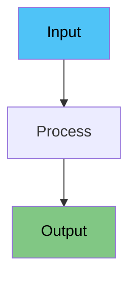

## Part 1: Speaker Notes Generation

### Deck Structure Requirements
1. **First Slide (Title Slide)**: Always add `center: true` property to vertically center the content
2. **SlideGroups Organization**: Break each major topic/pattern into multiple slides:
   - Maintain `slideGroups` structure with logical groupings
   - Each `slideGroup` should have an `id`, `title`, and `slides` array
   - Group related concepts together under meaningful topic headings

Write the speaker notes for a live presentation to freshers/beginners.

### Format & Structure
- Use `###` for slide title at the top of each note
- Use `####` (H4) for section headings within the note
- Minimize blank lines - keep content compact and flowing
- Use **bold** for key terms and *italics* for emphasis
- Use bullet points sparingly - prefer full flowing sentences

### Writing Style
- Write in a **teleprompter-friendly script**: full sentences that flow naturally when spoken aloud
- Use a **conversational, engaging tone** - like you're explaining to a friend
- Keep sentences short to medium length - easy to read while presenting
- Connect ideas smoothly within paragraphs - don't just list disconnected points
- Include smooth **transitions between sections** (e.g., "Now that we've seen X, let's look at Y...")

### Pronunciation Guides
- **Scientific notation**: Always bracket how to read it
  - Example: `2e-5` → "2e-5 (two e minus five)"
  - Example: `1e-3` → "1e-3 (one e minus three)"
  - Example: `5e6` → "5e6 (five e six)"
- **Technical terms/acronyms**: Add pronunciation guide with 👉 for new or difficult terms
  - **Show phonetic pronunciation only - do NOT expand what the abbreviation stands for**
  - Example: `RoBERTa` → "RoBERTa 👉 'roh-BER-tuh'"
  - Example: `BERT` → "BERT 👉 'burt'"
  - Example: `spaCy` → "spaCy 👉 'spay-see'"
  - Example: `NVIDIA` → "NVIDIA 👉 'en-VID-ee-uh'"
- **Greek letters**: Include English name
  - Example: `λ` → "λ (lambda)"
  - Example: `α` → "α (alpha)"

### Content Guidelines
- Explain every concept in **very simple words** - assume zero background knowledge
- Add **small examples or analogies** (1-2 lines) wherever helpful to illustrate points
- For technical concepts, explain the "why" not just the "what"
- Include rhetorical questions to engage the audience (e.g., "Simple, right?", "But what about...?")
- End each slide's notes with a natural lead-in to the next topic
- **Always include pronunciation guides** for scientific notation and technical terms on first mention

### Visual Elements in Notes
- Include **Mermaid diagrams** in the notes where helpful to visualize concepts:

- Use emoji sparingly for section headers (e.g., `####  When to Use This?`)
- Use `>` blockquotes for audience interaction prompts:
  >  Ask the audience: "Has anyone experienced this?"

### Pros/Cons Sections
When discussing advantages and disadvantages:
```
####  Pros
The good stuff: [describe benefits in flowing sentences, not just bullets]

####  Cons
The problems: [describe drawbacks in flowing sentences]
```

### Example Note Structure
```
### [Slide Number] [Slide Title]
Opening hook or transition from previous slide. Set context for this topic.

####  [First Section]
Explanation in full sentences. Include an example or analogy here. Make it conversational and easy to follow while presenting.

####  [Key Concept]
\`\`\`mermaid
[diagram if helpful]
\`\`\`
Explain what the diagram shows. Connect it to the main point.

####  When to Use This?
Describe practical scenarios in complete sentences.

####  Pros
The good stuff: [flowing description of benefits]

####  Cons
The problems: [flowing description of drawbacks]

Closing statement that leads into the next slide.
```

### Do NOT Include in Notes
- `[pause]`, `[demo]`, `[point to X]` cue tags - use markdown formatting instead
- Excessive blank lines or `---` horizontal rules
- `##` or `###` headings - use `####` for sections within notes
- Bullet-only content without explanatory sentences
- Jargon without explanation

---

## Part 2: Interactive Mermaid Diagrams

**IMPORTANT**: Whenever you include a Mermaid diagram in the speaker notes, you MUST also add a corresponding `MermaidPopover` component in the slide content JSX.

### How to Add MermaidPopover

1. **Import the component** at the top of the deck file:
```tsx
import { MermaidPopover } from '../components/MermaidPopover';
```

2. **Add the MermaidPopover** inline with the relevant heading in the slide content:
```tsx
<h4>
  How It Works
  <MermaidPopover
    title="Process Flow"
    diagram={`flowchart LR
    A["📋 Input"] --> B["🔍 Process"]
    B --> C["✨ Output"]
    style A fill:#4fc3f7,color:#000
    style C fill:#81c784,color:#000`}
  />
</h4>
```

### MermaidPopover Guidelines

- **Placement**: Add it inside the `<h4>` tag next to headings like "How It Works", "The Flow", "Process Overview", etc.
- **Title**: Use a clear, descriptive title for the diagram
- **Diagram**: Copy the exact Mermaid code from the notes section
- **Styling**: Use consistent color schemes:
  - `#4fc3f7` (blue) for inputs/starts
  - `#81c784` (green) for outputs/success
  - `#ffcdd2` (red) for errors/problems
  - `#ffd700` (gold) for highlights/goals
  - `#e1bee7` (purple) for special items

### Example Pattern

**In Notes:**
```markdown
####  How It Works
The system processes data through three stages...

\`\`\`mermaid
flowchart TB
    A["🤖 Model"] --> B["⚙️ Process"]
    B --> C["✅ Result"]
    style C fill:#81c784,color:#000
\`\`\`
```

**In Slide Content:**
```tsx
<GSAPAnimated animation="slideInLeft" delay={0.3}>
  <div style={{ marginBottom: '0.7em' }}>
    <h4>
      How It Works
      <MermaidPopover
        title="Processing Flow"
        diagram={`flowchart TB
    A["🤖 Model"] --> B["⚙️ Process"]
    B --> C["✅ Result"]
    style C fill:#81c784,color:#000`}
      />
    </h4>
    <ul style={{ fontSize: '0.7em' }}>
      <li>Description of the process...</li>
    </ul>
  </div>
</GSAPAnimated>
```

---

## Part 3: GSAP Animations

Apply creative GSAP animations to bring slides to life visually.

### Import Components
```tsx
import { GSAPAnimated, GSAPStaggerList } from '../components/GSAPAnimated';
```

### Animation Variety
Use a diverse mix of these animations:
- `fadeIn` - Simple fade for subtle entries
- `slideInLeft`, `slideInRight` - Horizontal movements
- `slideInTop`, `slideInBottom` - Vertical movements
- `scaleIn` - Pop-in effects for emphasis
- `bounceIn` - Playful, elastic entries
- `rotateIn` - Spinning entries for wow factor
- `flipCard` - 3D flip effects for dramatic reveals

### Strategic Delays
Vary delay timings to create interesting sequences:
- Quick succession: delays of 0.1-0.2s between elements
- Paced reveals: delays of 0.3-0.5s for emphasis
- Dramatic pauses: delays of 0.6-1.0s for impact

### Creative Patterns for Different Slide Types

**Title Slides**: Use bold, attention-grabbing animations
```tsx
<GSAPAnimated animation="rotateIn" duration={1} delay={0}>
  <SvgIcon iconName="duo-rocket" sizeName="3x" />
</GSAPAnimated>
<GSAPAnimated animation="scaleIn" delay={0.3}>
  <h1>Title</h1>
</GSAPAnimated>
<GSAPAnimated animation="fadeIn" delay={0.6}>
  <p>Subtitle</p>
</GSAPAnimated>
```

**Content Slides**: Mix directional slides for visual flow
```tsx
<GSAPAnimated animation="slideInLeft" delay={0.1}>
  <div>First section</div>
</GSAPAnimated>
<GSAPAnimated animation="slideInRight" delay={0.3}>
  <div>Second section</div>
</GSAPAnimated>
```

**Lists**: Use staggered animations
```tsx
<GSAPStaggerList stagger={0.12} duration={0.7}>
  <div>Item 1</div>
  <div>Item 2</div>
  <div>Item 3</div>
</GSAPStaggerList>
```

**Key Points/Highlights**: Use bounceIn or scaleIn for emphasis
```tsx
<GSAPAnimated animation="bounceIn" duration={1} delay={0.2}>
  <div className="key-point">Important concept!</div>
</GSAPAnimated>
```

**Comparisons (Pros/Cons)**: Use opposing directions
```tsx
<GSAPAnimated animation="slideInLeft" delay={0.1}>
  <div>Pros section</div>
</GSAPAnimated>
<GSAPAnimated animation="slideInRight" delay={0.3}>
  <div>Cons section</div>
</GSAPAnimated>
```

### Animation Guidelines
- **Be Creative & Varied**: Don't use the same animation patterns for every slide
- **Every slide** should have at least one animated element
- **Complex slides** should have 3-5 animated sections with varied timings
- **Icons and visual elements** should use more dramatic animations (rotate, bounce, scale)
- **Text content** can use subtler animations (fade, slide)
- **Lists** always benefit from stagger animations
- **Maintain readability** - don't make animations too fast or too distracting

### Duration Recommendations
- Quick animations (text, small elements): 0.5-0.7s
- Standard animations (content blocks): 0.7-0.9s
- Dramatic animations (titles, highlights): 0.9-1.2s
- Stagger durations: 0.5-0.8s

### Randomization Tips
- Don't use the same animation type twice in a row on consecutive slides
- Vary between quick (0.5-0.7s) and slow (0.9-1.2s) durations
- Mix subtle animations (fadeIn) with dramatic ones (bounceIn, rotateIn)
- Use different stagger values (0.08, 0.12, 0.15, 0.2) for variety

### Animation Type Guide

| Animation | Best For | Impact Level |
|-----------|----------|--------------|
| `fadeIn` | Text, backgrounds | Subtle |
| `slideInLeft/Right` | Content blocks, comparisons | Medium |
| `slideInTop/Bottom` | Headers, footers | Medium |
| `scaleIn` | Numbers, icons, emphasis | High |
| `bounceIn` | CTAs, highlights | High |
| `rotateIn` | Icons, logos | Very High |
| `flipCard` | Reveals, transitions | Very High |

---

## Complete Example Slide

Here's a full example combining all three elements:

```tsx
{
  id: 3,
  title: 'How It Works',
  icon: { name: 'duo-gear' },
  content: (
    <div style={{ textAlign: 'left' }}>
      <GSAPAnimated animation="slideInTop" delay={0.1}>
        <div style={{ marginBottom: '0.7em' }}>
          <h4>Goal</h4>
          <ul style={{ fontSize: '0.7em' }}>
            <li>Achieve high accuracy with less data</li>
          </ul>
        </div>
      </GSAPAnimated>
      
      <GSAPAnimated animation="slideInLeft" delay={0.3}>
        <div style={{ marginBottom: '0.7em' }}>
          <h4>
            How It Works
            <MermaidPopover
              title="Processing Pipeline"
              diagram={`flowchart LR
    A["📄 Input"] --> B["⚙️ Process"]
    B --> C["✅ Output"]
    style A fill:#4fc3f7,color:#000
    style C fill:#81c784,color:#000`}
            />
          </h4>
          <ul style={{ fontSize: '0.7em' }}>
            <li>Process data through multiple stages</li>
          </ul>
        </div>
      </GSAPAnimated>
      
      <GSAPAnimated animation="slideInRight" delay={0.5}>
        <div style={{ marginBottom: '0.7em' }}>
          <h4>When to Use</h4>
          <ul style={{ fontSize: '0.7em' }}>
            <li>Limited training data available</li>
          </ul>
        </div>
      </GSAPAnimated>
    </div>
  ),
  backgroundColor: '#2d4a6f',
  notes: `### How It Works
Let's explore how this process actually functions in practice.

####  The Goal
We want to achieve **high accuracy with minimal training data**. This is crucial when you're working in specialized domains where labeled data is expensive or time-consuming to create.

####  How It Works
The system operates through a multi-stage pipeline that transforms raw input into actionable results.

\`\`\`mermaid
flowchart LR
    A["📄 Input"] --> B["⚙️ Process"]
    B --> C["✅ Output"]
    style A fill:#4fc3f7,color:#000
    style C fill:#81c784,color:#000
\`\`\`

At each stage, the data is refined and enhanced, gradually moving from raw input to polished output.

####  When to Use This?
This approach works best when you have **limited training data** available. It's particularly effective in specialized domains where creating labeled datasets would be prohibitively expensive or time-consuming.

Now let's look at the practical steps to implement this...`
}
```

---

## Part 4: Glass Morphism Card Styling

Add a modern glass morphism effect to deck cards on the homepage using the first slide's background image.

### When to Apply Glass Morphism

Use glass morphism for decks that:
- Have visually striking background images on the first slide
- Want to stand out on the homepage
- Benefit from a premium, modern aesthetic
- Have high-quality photography or space/tech imagery

### How to Add Glass Morphism

Add these properties to your deck configuration (right after the `theme` property):

```typescript
export const yourDeck: Deck = {
  id: 'your-deck-id',
  name: 'Your Deck Name',
  description: 'Your deck description',
  category: 'NLP',
  theme: 'moon',
  cardClassName: 'glass-morphism',
  cardStyle: {
    backgroundImage: 'url(https://images.unsplash.com/photo-1451187580459-43490279c0fa?w=1920&q=80)',
    backgroundSize: 'cover',
    backgroundPosition: 'center',
  },
  slides: [],
  slideGroups: [
    // ... your slides
  ]
};
```

### Example with Real URL

```typescript
cardClassName: 'glass-morphism',
cardStyle: {
  backgroundImage: 'url(https://images.unsplash.com/photo-1451187580459-43490279c0fa?w=1920&q=80)',
  backgroundSize: 'cover',
  backgroundPosition: 'center',
},
```

### Notes

- The glass morphism CSS is already defined in `src/pages/HomePage.css`
- No need to modify CSS files unless you want deck-specific customizations
- The effect works best with high-contrast, visually interesting background images
- Text color automatically changes to white for readability

---

## Part 4: Deck Structure Example

### Complete Deck with SlideGroups

```tsx
import type { Deck } from './types';
import { GSAPAnimated, GSAPStaggerList } from '../components/GSAPAnimated';
import { MermaidPopover } from '../components/MermaidPopover';

export const exampleDeck: Deck = {
  id: 'example-deck',
  name: 'Example Topic',
  description: 'Understanding the fundamentals',
  category: 'RAG',
  theme: 'night',
  slideGroups: [
    {
      id: 'introduction',
      title: 'Introduction',
      slides: [
        {
          id: 1,
          title: 'Example Topic',
          center: true, // ALWAYS add center: true for title slides
          content: (
            <div>
              <h2>Example Topic</h2>
              <p>Understanding the fundamentals</p>
            </div>
          ),
          backgroundColor: '#2c3e50',
          notes: 'Welcome note...'
        }
      ]
    },
    {
      id: 'core-concepts',
      title: 'Core Concepts',
      slides: [
        {
          id: 2,
          title: 'What is X?',
          content: (
            <GSAPAnimated animation="fadeIn">
              <h3>What is X?</h3>
              <p>Definition and explanation...</p>
            </GSAPAnimated>
          ),
          backgroundColor: '#34495e',
          notes: 'Explanation of X...'
        },
        {
          id: 3,
          title: 'Key Components',
          content: (
            <div>
              <GSAPAnimated animation="slideInTop">
                <h4>
                  Components Overview
                  <MermaidPopover
                    title="System Architecture"
                    diagram={\`flowchart TB
    A["Input"] --> B["Process"]
    B --> C["Output"]
    style A fill:#4fc3f7,color:#000\`}
                  />
                </h4>
              </GSAPAnimated>
              <GSAPStaggerList items={['Component 1', 'Component 2', 'Component 3']} />
            </div>
          ),
          backgroundColor: '#34495e',
          notes: 'Breaking down the components...'
        }
      ]
    },
    {
      id: 'implementation',
      title: 'Implementation Details',
      slides: [
        {
          id: 4,
          title: 'How to Implement',
          content: (
            <GSAPAnimated animation="slideInLeft">
              <h3>Implementation Steps</h3>
              <ol>
                <li>Step 1</li>
                <li>Step 2</li>
                <li>Step 3</li>
              </ol>
            </GSAPAnimated>
          ),
          backgroundColor: '#2980b9',
          notes: 'Step-by-step guide...'
        }
      ]
    },
    {
      id: 'best-practices',
      title: 'Best Practices',
      slides: [
        {
          id: 5,
          title: 'Tips & Tricks',
          content: (
            <GSAPAnimated animation="zoomIn">
              <h3>Best Practices</h3>
              <p>Follow these guidelines...</p>
            </GSAPAnimated>
          ),
          backgroundColor: '#27ae60',
          notes: 'Important tips...'
        }
      ]
    }
  ]
};
```

### SlideGroup Organization Guidelines

1. **Logical Grouping**: Group related slides under meaningful topics
2. **Group Size**: 2-5 slides per group typically works well
3. **Progression**: Order groups to build knowledge progressively
4. **Naming**: Use clear, descriptive `id` and `title` for each group

**Common Group Patterns:**
- Introduction → Core Concepts → Implementation → Best Practices
- Problem → Solution → Examples → Trade-offs
- Overview → Deep Dive → Use Cases → Summary

---

## Workflow Summary

When creating a new deck:

1. **Write speaker notes** with clear explanations, examples, and mermaid diagrams
2. **Structure the deck**:
   - Set `center: true` on the first (title) slide
   - Organize slides into logical `slideGroups`
   - Break major topics into multiple slides within each group
3. **Create slide content** with:
   - GSAP animations for visual engagement
   - MermaidPopover components for any diagrams in the notes
   - Proper structure and styling
4. **Add glass morphism styling** (optional):
   - If the first slide has a striking background image
   - Add `cardClassName: 'glass-morphism'` and `cardStyle` with the background image
   - Creates a premium frosted glass effect on the homepage card
5. **Review** to ensure:
   - Title slide has `center: true`
   - Slides are properly grouped in `slideGroups`
   - Notes flow naturally when read aloud
   - Every mermaid diagram in notes has a corresponding MermaidPopover in content
   - Animations are varied and purposeful
   - Content is beginner-friendly
   - Glass morphism (if applied) displays correctly with readable text

---

## Quick Reference

**Required Imports:**
```tsx
import { GSAPAnimated, GSAPStaggerList } from '../components/GSAPAnimated';
import { MermaidPopover } from '../components/MermaidPopover';
```

**Common Color Palette for Diagrams:**
- Input/Start: `#4fc3f7` (blue)
- Output/Success: `#81c784` (green)
- Error/Problem: `#ffcdd2` (red)
- Highlight/Goal: `#ffd700` (gold)
- Special: `#e1bee7` (purple)
