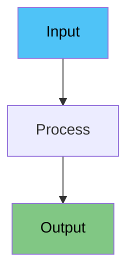

# Speaker Notes Generation Prompt

Rewrite the speaker notes for a live presentation to freshers/beginners.

## Requirements

### Format & Structure
- Use `###` for slide title at the top of each note
- Use `####` (H4) for section headings within the note
- Minimize blank lines - keep content compact and flowing
- Use **bold** for key terms and *italics* for emphasis
- Use bullet points sparingly - prefer full flowing sentences

### Writing Style
- Write in a **teleprompter-friendly script**: full sentences that flow naturally when spoken aloud
- Use a **conversational, engaging tone** - like you're explaining to a friend
- Keep sentences short to medium length - easy to read while presenting
- Connect ideas smoothly within paragraphs - don't just list disconnected points
- Include smooth **transitions between sections** (e.g., "Now that we've seen X, let's look at Y...")

### Content Guidelines
- Explain every concept in **very simple words** - assume zero background knowledge
- Add **small examples or analogies** (1-2 lines) wherever helpful to illustrate points
- For technical concepts, explain the "why" not just the "what"
- Include rhetorical questions to engage the audience (e.g., "Simple, right?", "But what about...?")
- End each slide's notes with a natural lead-in to the next topic

### Visual Elements
- Include **Mermaid diagrams** where helpful to visualize concepts:

- Use emoji sparingly for section headers (e.g., `####  When to Use This?`)
- Use `>` blockquotes for audience interaction prompts:
  >  Ask the audience: "Has anyone experienced this?"

### Pros/Cons Sections
When discussing advantages and disadvantages:
```
####  Pros
The good stuff: [describe benefits in flowing sentences, not just bullets]

####  Cons
The problems: [describe drawbacks in flowing sentences]
```

### Example Note Structure
```
### [Slide Number] [Slide Title]
Opening hook or transition from previous slide. Set context for this topic.

####  [First Section]
Explanation in full sentences. Include an example or analogy here. Make it conversational and easy to follow while presenting.

####  [Key Concept]
`mermaid
[diagram if helpful]
`
Explain what the diagram shows. Connect it to the main point.

####  When to Use This?
Describe practical scenarios in complete sentences.

####  Pros
The good stuff: [flowing description of benefits]

####  Cons
The problems: [flowing description of drawbacks]

Closing statement that leads into the next slide.
```

## Do NOT Include
- `[pause]`, `[demo]`, `[point to X]` cue tags - use markdown formatting instead
- Excessive blank lines or `---` horizontal rules
- `##` or `###` headings - use `####` for sections within notes
- Bullet-only content without explanatory sentences
- Jargon without explanation
